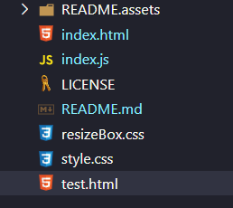
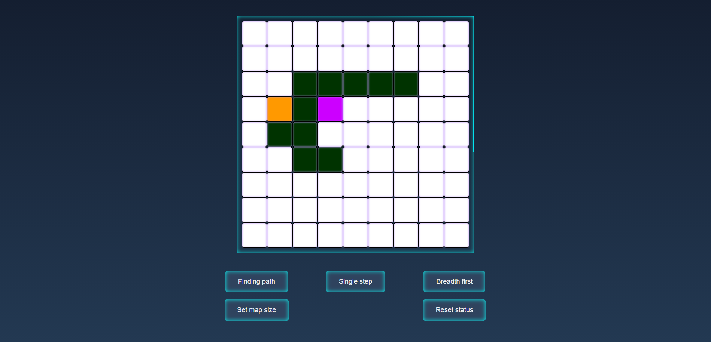
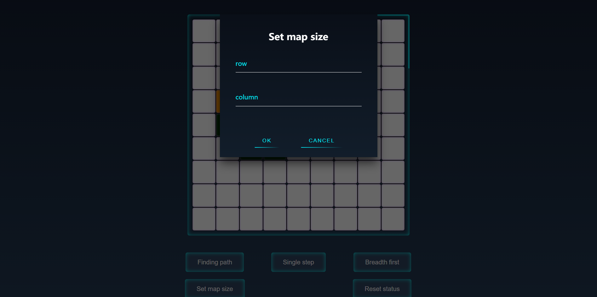

[TOC]

# A* Pathfinding

## Project structure

Open `index.html` with the latest browser index.html.

Project url：**[https://github.com/dandelion1024/maze-pathfinding](https://github.com/dandelion1024/maze-pathfinding)**

## Run

Clone the project and open `index.html` with your browser.

 **Note: never use an old browser** 

## Main interface

## Set barriers

Left click the node except the starting point and the end point, then you can switch the road to an obstacle, or switch the obstacle to a road.

## Set the start and end points

The first click of the right mouse button will set the node in the point as the starting point, the second click will set the node in the point as the ending point, and the third click will set the starting point, alternating back and forth.

## Set map size

Click `map size` button to pop up the floating window of setting the map size.

## Single step execution

Click `single step` to perform a detection. You need to click all the time.

Click to start automatic pathfinding.

## Other

Just follow the prompts. If there is a bug occasionally, please refresh the webpage.