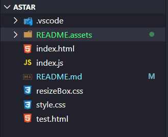
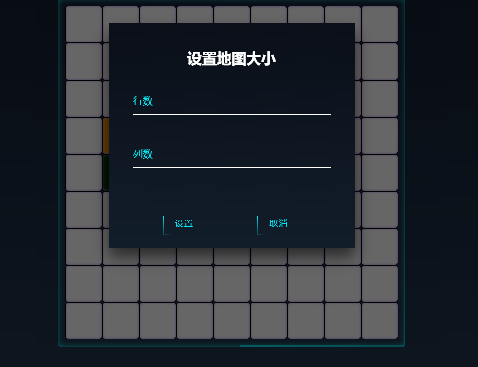

[TOC]

# A* 寻路算法

## 项目结构

其中 `index.html` 为执行程序的入口，使用最新浏览器打开即可，`index.js` 为逻辑代码包括 A* 寻路，宽度优先搜索等。

项目地址：**[https://gitee.com/idlezero/Astar](https://gitee.com/idlezero/Astar)**

## 程序运行需求

运行方法，直接打开网址 **[http://zerosharp.top/Astar/](http://zerosharp.top/Astar/)** 即可。

或者把项目下载下来后使用浏览器打开 index.html 即可进入主界面

 **注：千万不要使用太古老的浏览器** 

## 主界面

## 设置地图障碍

**鼠标左键点击** 除了起点和终点之外的节点，则可以切换路为障碍，或者切换障碍为路。

## 设置起点和终点

**鼠标右键第一次点击**则将点中的节点设置为起点，**第二次点击**则将点中的节点设置为终点，第三次又是设置起点，来回交替。

## 设置地图大小

点击地图大小将会弹出设置窗口大小的悬浮窗，设置好后点击确定即可。

## 单步执行和开始寻路

点击单步执行，则会执行A*算法的一次探测，一直点击则一直执行。

点击开始寻路则自动执行。

## 其他

其他的根据提示即可，如果偶然出现 bug 请刷新网页。